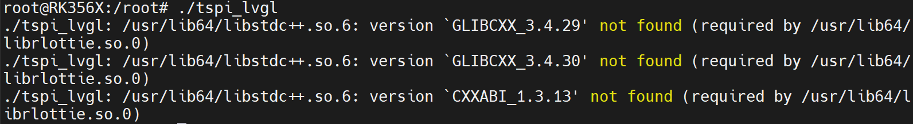
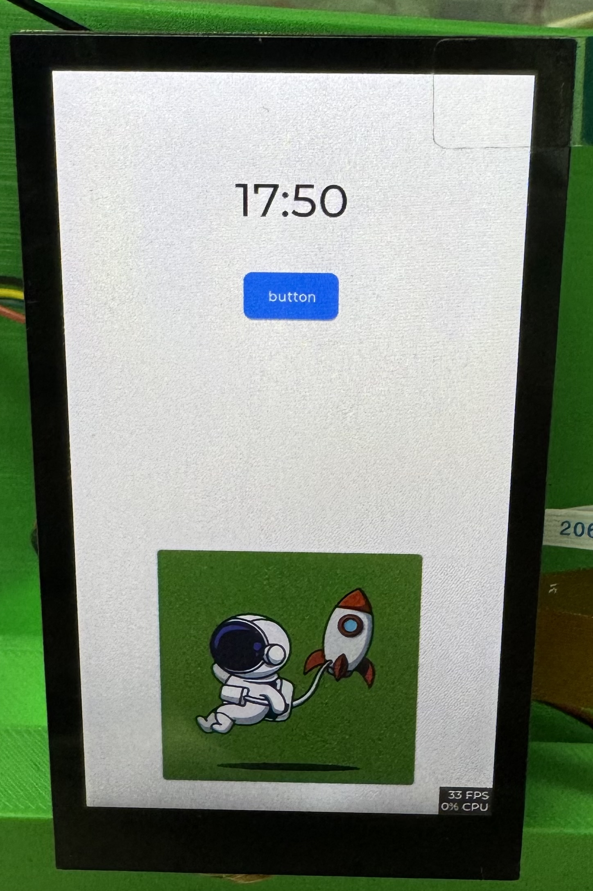

# 泰山派

## 一、Android系统

### MIPI屏幕

|   物料   |     参数     |                             链接                             |
| :------: | :----------: | :----------------------------------------------------------: |
| 触摸屏幕 | 40pin 、MIPI | [屏幕链接](https://item.taobao.com/item.htm?id=602182011852&spm=a1z10.3-c-s.w4002-22343514690.13.64367efeFqZiog&skuId=4821755299220) |


#### 修改设备树

```c
//添加FT5316触摸屏
&i2c1 {
	status = "okay";
	ft5316@38 {
		pinctrl-0 = <&touch_gpio>;
		compatible = "focaltech,fts";
		reg = <0x38>;
		focaltech,max-touch-number = <2>;
		focaltech,display-coords =<0 0 854 480>;
		focaltech,irq-gpio = <&gpio1 RK_PA0 IRQ_TYPE_LEVEL_LOW>;
		focaltech,reset-gpio = <&gpio1 RK_PA1 GPIO_ACTIVE_HIGH>;
	};
};
// 添加3.1寸mipi屏幕
&dsi1 {
	status = "okay";
	rockchip,lane-rate = <480>;
	dsi1_panel: panel@0 {
		status = "okay";
		compatible = "simple-panel-dsi";
		reset-gpios = <&gpio3 RK_PC1 GPIO_ACTIVE_LOW>;
		pinctrl-names = "default";
		pinctrl-0 = <&dsi1_rst_gpio>;
		reg = <0>;
		backlight = <&backlight>;
		reset-delay-ms = <200>;
		enable-delay-ms = <100>;
		prepare-delay-ms = <20>;
		unprepare-delay-ms = <20>;
		disable-delay-ms = <20>;
		init-delay-ms = <120>;
		dsi,flags = <(MIPI_DSI_MODE_VIDEO | MIPI_DSI_MODE_VIDEO_BURST |
			MIPI_DSI_MODE_LPM | MIPI_DSI_MODE_EOT_PACKET)>;
		dsi,format = <MIPI_DSI_FMT_RGB888>;
		dsi,lanes  = <2>;  // 注意这里是2
		panel-init-sequence = [
			05 78 01 01
			05 78 01 11
			39 0A 06 FF 77 01 00 00 13
			15 0A 02 EF 08
			39 0A 06 FF 77 01 00 00 10
			39 0A 03 C0 E9 03
			39 0A 03 C1 10 0C
			39 0A 03 C2 20 0A
			15 0A 02 CC 10
			39 0A 11 B0 00 23 2A 0A 0E 03 12 06 06 2A 00 10 0F 2D 34 1F
			39 0A 11 B1 00 24 2B 0F 12 07 15 0A 0A 2B 08 13 10 2D 33 1F
			39 0A 06 FF 77 01 00 00 11
			15 0A 02 B0 4D
			15 0A 02 B1 48
			15 0A 02 B2 84
			15 0A 02 B3 80
			15 0A 02 B5 45
			15 0A 02 B7 85
			15 0A 02 B8 33
			15 0A 02 C1 78
			15 0A 02 C2 78
			15 0A 02 D0 88
			39 0A 04 E0 00 00 02
			39 0A 0C E1 06 A0 08 A0 05 A0 07 A0 00 44 44
			39 0A 0D E2 30 30 44 44 6E A0 00 00 6E A0 00 00
			39 0A 05 E3 00 00 33 33
			39 0A 03 E4 44 44
			39 0A 11 E5 0D 69 0A A0 0F 6B 0A A0 09 65 0A A0 0B 67 0A A0
			39 0A 05 E6 00 00 33 33
			39 0A 03 E7 44 44
			39 0A 11 E8 0C 68 0A A0 0E 6A 0A A0 08 64 0A A0 0A 66 0A A0
			39 0A 03 E9 36 00
			39 0A 08 EB 00 01 E4 E4 44 88 40
			39 0A 11 ED FF 45 67 FA 01 2B CF FF FF FC B2 10 AF 76 54 FF
			39 0A 07 EF 10 0D 04 08 3F 1F
			05 78 01 11
			15 0A 02 3A 55
			05 14 01 29
		];

		panel-exit-sequence = [
			05 00 01 28
			05 00 01 10
		];

		disp_timings1: display-timings {
			native-mode = <&dsi1_timing0>;
			dsi1_timing0: timing0 {
				clock-frequency = <33500000>;
				hactive = <480>;   //与 LCDTiming.LCDH 对应
				vactive = <854>;   //与 LCDTiming.LCDV 对应
				hfront-porch = <8>;   //与 LCDTiming.HFPD 对应 
				hsync-len = <2>;   //与 LCDTiming.HSPW 对应
				hback-porch = <43>;   //与 LCDTiming.HBPD 对应
				vfront-porch = <4>;   //与 LCDTiming.VEPD 对应
				vsync-len = <10>;   //与 LCDTiming.VsPW 对应
				vback-porch = <42>;   //与 LCDTiming.VBPD 对应
				hsync-active = <0>;
				vsync-active = <0>;
				de-active = <0>;
				pixelclk-active = <1>;
				swap-rb = <0>;
				swap-rg = <0>;
				swap-gb = <0>;
			};
		};

		ports {
			#address-cells = <1>;
			#size-cells = <0>;

			port@0 {
				reg = <0>;
				panel_in_dsi1: endpoint {
					remote-endpoint = <&dsi1_out_panel>;
				};
			};
		};
	};
	ports {
		#address-cells = <1>;
		#size-cells = <0>;

		port@1 {
			reg = <1>;
			dsi1_out_panel: endpoint {
				remote-endpoint = <&panel_in_dsi1>;
			};
		};
	};

};
```

#### 编译kernel

```shell
# 进入kernel目录
cd kernel
# 清除.o文件
make clean -j32
# 清除.o、配置文件等,比clean指令猛
make distclean -j32
# 设置配置项
make ARCH=arm64 tspi_defconfig rk356x_evb.config android-11.config && make ARCH=arm64 tspi-rk3566-user-v10.img -j32
# 编译kernel
make ARCH=arm64 BOOT_IMG=../rockdev/Image-rk3566_tspi/boot.img tspi-rk3566-user-v10.img -j32
# 生成镜像
./mkimage.sh
# 生成update镜像
./build.sh -u
```

#### 编译Android

```shell
 source build/envsetup.sh && lunch rk3566_tspi-userdebug
 # 重新编译android，注意千万不要使用make clean指令，否则将重新编译，时间非常长
 make installclean -j32 && make -j32
```

## 二、Linux buildroot系统

### 2.1 移植MIPI屏幕

#### 2.1.1 修改设备树

```c
// 修改<SDK>/kernel/arch/arm64/boot/dts/rockchip/tspi-rk3566-user-v10-linux.dts
// #include "tspi-rk3566-edp-v10.dtsi"
// #include "tspi-rk3566-hdmi-v10.dtsi"		
#include "tspi-rk3566-dsi-v10.dtsi"		// 使能dsi屏幕

// 修改<SDK>/kernel/arch/arm64/boot/dts/rockchip/tspi-rk3566-dsi-v10-.dtsi
// 完整内容如下，修改了屏幕参数（初始化序列，屏幕参数），添加了FT5316触摸设备
/ {
	backlight: backlight {
		compatible = "pwm-backlight";
		pwms = <&pwm5 0 25000 0>;
		brightness-levels = <
			  0  20  20  21  21  22  22  23
			 23  24  24  25  25  26  26  27
			 27  28  28  29  29  30  30  31
			 31  32  32  33  33  34  34  35
			 35  36  36  37  37  38  38  39
			 40  41  42  43  44  45  46  47
			 48  49  50  51  52  53  54  55
			 56  57  58  59  60  61  62  63
			 64  65  66  67  68  69  70  71
			 72  73  74  75  76  77  78  79
			 80  81  82  83  84  85  86  87
			 88  89  90  91  92  93  94  95
			 96  97  98  99 100 101 102 103
			104 105 106 107 108 109 110 111
			112 113 114 115 116 117 118 119
			120 121 122 123 124 125 126 127
			128 129 130 131 132 133 134 135
			136 137 138 139 140 141 142 143
			144 145 146 147 148 149 150 151
			152 153 154 155 156 157 158 159
			160 161 162 163 164 165 166 167
			168 169 170 171 172 173 174 175
			176 177 178 179 180 181 182 183
			184 185 186 187 188 189 190 191
			192 193 194 195 196 197 198 199
			200 201 202 203 204 205 206 207
			208 209 210 211 212 213 214 215
			216 217 218 219 220 221 222 223
			224 225 226 227 228 229 230 231
			232 233 234 235 236 237 238 239
			240 241 242 243 244 245 246 247
			248 249 250 251 252 253 254 255
		>;
		default-brightness-level = <50>;
	};
};
// 添加FT5316触摸屏
&i2c1 {
	status = "okay";
	ft5316@38 {
		pinctrl-0 = <&touch_gpio>;
		compatible = "focaltech,fts";
		reg = <0x38>;
		focaltech,max-touch-number = <2>;
		// focaltech,display-coords =<0 0 854 480>;
		focaltech,irq-gpio = <&gpio1 RK_PA0 IRQ_TYPE_LEVEL_LOW>;
		focaltech,reset-gpio = <&gpio1 RK_PA1 GPIO_ACTIVE_HIGH>;
	};
};

&pwm5 {
	status = "okay";
};


&pinctrl {
	dsi1 {
		dsi1_rst_gpio: dsi1-rst-gpio {
			rockchip,pins = <3 RK_PC1 RK_FUNC_GPIO &pcfg_pull_none>;
		};
        // 添加pinctrl
		touch_gpio: touch-gpio {
			rockchip,pins = <1 RK_PA0 RK_FUNC_GPIO &pcfg_pull_up>;
		};
	};
};

/*
 * video_phy1 needs to be enabled
 * when dsi1 is enabled
 */
&dsi1 {
	status = "okay";
};

&dsi1_in_vp0 {
	status = "okay";
};

&dsi1_in_vp1 {
	status = "disabled";
};

&video_phy1 {
	status = "okay";
};

&route_dsi1 {
	status = "okay";//wucaicheng mipi okay
	connect = <&vp0_out_dsi1>;
};

// 3寸480x854
&dsi1 {
	status = "okay";
	rockchip,lane-rate = <480>;
	dsi1_panel: panel@0 {
		status = "okay";
		compatible = "simple-panel-dsi";
		reset-gpios = <&gpio3 RK_PC1 GPIO_ACTIVE_LOW>;
		pinctrl-names = "default";
		pinctrl-0 = <&dsi1_rst_gpio>;
		reg = <0>;
		backlight = <&backlight>;
		reset-delay-ms = <200>;
		enable-delay-ms = <100>;
		prepare-delay-ms = <20>;
		unprepare-delay-ms = <20>;
		disable-delay-ms = <20>;
		init-delay-ms = <120>;
		dsi,flags = <(MIPI_DSI_MODE_VIDEO | MIPI_DSI_MODE_VIDEO_BURST |
			MIPI_DSI_MODE_LPM | MIPI_DSI_MODE_EOT_PACKET)>;
		dsi,format = <MIPI_DSI_FMT_RGB888>;
		dsi,lanes  = <2>;
		panel-init-sequence = [
			05 78 01 01
			05 78 01 11
			39 0A 06 FF 77 01 00 00 13
			15 0A 02 EF 08
			39 0A 06 FF 77 01 00 00 10
			39 0A 03 C0 E9 03
			39 0A 03 C1 10 0C
			39 0A 03 C2 20 0A
			15 0A 02 CC 10
			39 0A 11 B0 00 23 2A 0A 0E 03 12 06 06 2A 00 10 0F 2D 34 1F
			39 0A 11 B1 00 24 2B 0F 12 07 15 0A 0A 2B 08 13 10 2D 33 1F
			39 0A 06 FF 77 01 00 00 11
			15 0A 02 B0 4D
			15 0A 02 B1 48
			15 0A 02 B2 84
			15 0A 02 B3 80
			15 0A 02 B5 45
			15 0A 02 B7 85
			15 0A 02 B8 33
			15 0A 02 C1 78
			15 0A 02 C2 78
			15 0A 02 D0 88
			39 0A 04 E0 00 00 02
			39 0A 0C E1 06 A0 08 A0 05 A0 07 A0 00 44 44
			39 0A 0D E2 30 30 44 44 6E A0 00 00 6E A0 00 00
			39 0A 05 E3 00 00 33 33
			39 0A 03 E4 44 44
			39 0A 11 E5 0D 69 0A A0 0F 6B 0A A0 09 65 0A A0 0B 67 0A A0
			39 0A 05 E6 00 00 33 33
			39 0A 03 E7 44 44
			39 0A 11 E8 0C 68 0A A0 0E 6A 0A A0 08 64 0A A0 0A 66 0A A0
			39 0A 03 E9 36 00
			39 0A 08 EB 00 01 E4 E4 44 88 40
			39 0A 11 ED FF 45 67 FA 01 2B CF FF FF FC B2 10 AF 76 54 FF
			39 0A 07 EF 10 0D 04 08 3F 1F
			05 78 01 11
			15 0A 02 3A 55
			05 14 01 29
		];

		panel-exit-sequence = [
			05 00 01 28
			05 00 01 10
		];

		disp_timings1: display-timings {
			native-mode = <&dsi1_timing0>;
			dsi1_timing0: timing0 {
				clock-frequency = <33000000>;
				hactive = <480>;   
				vactive = <854>;   
				hfront-porch = <8>;   
				hsync-len = <2>;   
				hback-porch = <43>;   
				vfront-porch = <4>;   
				vsync-len = <10>;  
				vback-porch = <42>;   
				hsync-active = <0>;
				vsync-active = <0>;
				de-active = <0>;
				pixelclk-active = <0>;
				swap-rb = <0>;
				swap-rg = <0>;
				swap-gb = <0>;
			};
		};

		ports {
			#address-cells = <1>;
			#size-cells = <0>;

			port@0 {
				reg = <0>;
				panel_in_dsi1: endpoint {
					remote-endpoint = <&dsi1_out_panel>;
				};
			};
		};
	};

	ports {
		#address-cells = <1>;
		#size-cells = <0>;

		port@1 {
			reg = <1>;
			dsi1_out_panel: endpoint {
				remote-endpoint = <&panel_in_dsi1>;
			};
		};
	};

};

```

#### 2.1.2 修改focaltech触摸屏代码

```c
// 修改<SDK>/kernel/drivers/input/touchscreen/focaltech_touch/focaltech_core.h
#define FTS_X_MAX_DISPLAY_DEFAULT           480			// 屏幕宽度
#define FTS_Y_MAX_DISPLAY_DEFAULT           854			// 屏幕高度
// 修改<SDK>/kernel/drivers/input/touchscreen/focaltech_touch/focaltech_core.c
// 如果不修改，x轴方向触摸是相反的
// 657行附近
#if 1
            input_report_abs(data->input_dev, ABS_MT_POSITION_X, 480 - events[i].x);
            input_report_abs(data->input_dev, ABS_MT_POSITION_Y, events[i].y);
#else
// 733行附近
		   input_report_abs(data->input_dev, ABS_MT_POSITION_X, 480-events[i].x);
            input_report_abs(data->input_dev, ABS_MT_POSITION_Y, events[i].y);
```

#### 2.1.3 修改kernel menuconfig

```shell
# 设置menuconfig
make ARCH=arm64 menuconfig
# 使能Focaltech_touchScreen 
Device_Drivers > Input_device_support > Touchscreens > Focaltech Touchscreen
# 保存
make ARCH=arm64 savedefconfig
# 覆盖
mv defconfig arch/arm64/configs/rockchip_linux_defconfig
# 单独编译kernel
./build.sh kernel
# 生成分散镜像
./mkfirmware.sh
# 生成独立镜像
./build.sh updateimg
```

### 2.2 移植 LVGL

#### 2.2.1 新建 tspi_lvgl 工程

> 克隆**lvgl**库和**lvgl_drivers**库，这两个库均选择8.3版本，按照如下说明进行修改

```shell
mkdir tspi_lvgl
cd tspi_lvgl
git clone -b v8.3.0 https://github.com/lvgl/lvgl.git
git clone -b v8.3.0 https://github.com/lvgl/lv_drivers.git


*****************************************lvgl修改***************************************************
# 将lvgl的配置文件lv_conf_template.h移动到tspi_lvgl目录，并重命名为lv_conf.h
# 1、将第15行附近： if 0 改为 if 1
# 2、使能第49行附近：#define LV_MEM_CUSTOM 1
# 3、使能一个示例demo：#define LV_USE_DEMO_BENCHMARK 1
# 4、使能该demo需要的字体：#define LV_FONT_MONTSERRAT_24 1


******************************************lv_drivers修改********************************************
# 将lv_drivers的配置文件lv_drv_conf_template.h移动到tspi_lvgl目录，并重命名为lv_drv_conf.h
# 1、将第11行附近： if 0 改为 if 1
# 2、使能第177行附近：#define USE_WAYLAND       1
# 3、在该行后面添加一行：#define LV_WAYLAND_TIMER_HANDLER 1
# 4、修改184行附近的几行：
		#    define LV_WAYLAND_CLIENT_SIDE_DECORATIONS 0
		#    define LV_WAYLAND_WL_SHELL 0
		#    define LV_WAYLAND_XDG_SHELL 1
# 5、进入lv_drivers/wayland目录,在该目录下打开一个终端黑窗口，执行下面程序
export CC=/usr/bin/aarch64-linux-gnu-gcc     #指定自己的交叉编译工具链
cmake .		  # 生成Makefile文件
make -j32	  # 编译，j后面的数字根据自己的线程数指定，也可以直接用make，速度会慢些
```

> 新建**CMakeLists.txt**文件，内容如下。

```cmake
cmake_minimum_required(VERSION 3.1)
project(tspi_lvgl)
SET(CMAKE_SYSTEM_NAME Linux)
SET(CMAKE_C_COMPILER /usr/bin/aarch64-linux-gnu-gcc) # 指定编译器
SET(GCC_WAYLAND_LINK_FLAGS    "-lwayland-client -lwayland-cursor -lxkbcommon -lpthread -lffi") # 链接
include_directories(.)
add_subdirectory(lvgl)
add_subdirectory(lv_drivers)
add_executable(${PROJECT_NAME} main.c )
target_link_libraries(${PROJECT_NAME} PRIVATE lvgl lvgl::examples lvgl::demos lvgl::drivers)
target_link_libraries(${PROJECT_NAME} PRIVATE ${GCC_WAYLAND_LINK_FLAGS})
```

> 将动态连接库复制到交叉编译工具链的lib目录下

```shell
# 所需要的动态连接库,位置：<SDK>/buildroot/output/rockchip_rk3566/target/usr/lib64
libxkbcommon.so
libxkbcommon.so.0
libxkbcommon.so.0.0.0
libwayland-client.so
libwayland-client.so.0
libwayland-client.so.0.20.0
libwayland-cursor.so
libwayland-cursor.so.0
libwayland-cursor.so.0.20.0
libffi.so
libffi.so.6
libffi.so.6.0.4

# 拷贝到ubuntu交叉编译工具链下面，我的交叉编译工具链库位置：/usr/aarch64-linux-gnu/lib
sudo cp libxkbcommon.so libxkbcommon.so.0   ...   libffi.so.6.0.4 /usr/aarch64-linux-gnu/lib

# 将动态库拷贝到泰山派上面的 usr/lib 目录下面，泰山派上面有的就不用拷贝了
1、连接wifi
2、buildroot中开启openssh
3、用scp命令发送文件，或者用软件连接都可以
```

> 在tspi_lvgl目录下新建main.c文件，内容如下：

```c
#include "lvgl/lvgl.h"
#include "lv_drivers/wayland/wayland.h"
#include "lvgl/demos/lv_demos.h"
#include <limits.h>
#include <errno.h>
#include <poll.h>
#include <stdio.h>
#include <unistd.h>
#include <pthread.h>
#define LV_HOR_RES_MAX (480)
#define LV_VER_RES_MAX (854)
#define DISP_BUF_SIZE (LV_HOR_RES_MAX * LV_VER_RES_MAX)
static lv_disp_draw_buf_t draw_buf;
static lv_color_t buf[DISP_BUF_SIZE];
int main(int argc, char ** argv)
{
    lv_init();
    lv_wayland_init();
    lv_disp_t *disp = lv_wayland_create_window(LV_HOR_RES_MAX, LV_VER_RES_MAX, "Window Title", NULL);
    lv_wayland_window_set_fullscreen(disp,true);
    lv_demo_benchmark();
    // lv_demo_widgets();
    struct pollfd pfd;
    uint32_t time_till_next;
    int sleep;
    pfd.fd = lv_wayland_get_fd();
    pfd.events = POLLIN;
    while (1)
    {
        /* Handle any Wayland/LVGL timers/events */
        time_till_next = lv_wayland_timer_handler();
        /* Run until the last window closes */
        if (!lv_wayland_window_is_open(NULL))
        {
            break;
        }
        /* Wait for something interesting to happen */
        if (time_till_next == LV_NO_TIMER_READY)
        {
            sleep = -1;
        }
        else if (time_till_next > INT_MAX)
        {
            sleep = INT_MAX;
        }
        else
        {
            sleep = time_till_next;
        }
        lv_tick_inc(50);
        lv_timer_handler() ;

        while ((poll(&pfd, 1, sleep) < 0) && (errno == EINTR));
    }
    return 0;
}
```

> 建好的tspi_lvgl工程结构如下

```shell
tspi_lvgl/
├── build
├── CMakeLists.txt
├── lv_conf.h
├── lv_drivers
├── lv_drv_conf.h
├── lvgl
└── main.c

# 上面的build目录是新建立的，用来存放编译后生成的文件
# 编译项目
    cd build
    cmake ..
    make -j32
    
# 将生成的tspi_lvgl可执行文件，复制到泰山派开发板上
scp tspi_lvgl   root@192.168.1.69:/root
密码：rockchip

# 泰山派执行程序
cd root
./tspi_lvgl 
```

#### 2.2.2 编写自己的UI界面

> 1、在tspi_lvgl目录下新建components目录
> 2、在components目录下新建CMakeList.txt文件
> 3、使用SquareLine_Studio生成界面，新建ui_code文件夹，将导出的代码放置在该目录下
> 4、拷贝ui_code到目录components目录下
> 5、修改tspi_lvgl目录下的CMakeList.txt文件
> 6、在main.c中添加头文件，和运行自己的ui即可

```cmake
# 修改上述components目录下新建CMakeList.txt文件，加入下面这一行即可
add_subdirectory(ui_code)


# 当前项目结构
tspi_lvgl/
├── build
├── CMakeLists.txt
├── components
├── lv_conf.h
├── lv_drivers
├── lv_drv_conf.h
├── lvgl
└── main.c


# 修改tspi_lvgl目录下的CMakeList.txt文件，完整内容如下
cmake_minimum_required(VERSION 3.1)
project(tspi_lvgl)
SET(CMAKE_SYSTEM_NAME Linux)
SET(CMAKE_C_COMPILER /usr/bin/aarch64-linux-gnu-gcc)
SET(GCC_WAYLAND_LINK_FLAGS    "-lwayland-client -lwayland-cursor -lxkbcommon -lpthread -lffi")
include_directories(.)
include_directories(./components/ui_code)			# 包含目录
add_subdirectory(lvgl)
add_subdirectory(lv_drivers)
add_subdirectory(components)
add_executable(${PROJECT_NAME} main.c )
target_link_libraries(${PROJECT_NAME} PRIVATE lvgl lvgl::examples lvgl::demos lvgl::drivers)
target_link_libraries(${PROJECT_NAME} PRIVATE ${GCC_WAYLAND_LINK_FLAGS})
target_link_libraries(${PROJECT_NAME} PRIVATE ui) 	# 链接ui


# 修改main.c文件
# include "ui.h"		 # 添加头文件
  ui_init();			 # 注释掉原来lv_demo_benchmark(),调用新的UI.
```

#### 2.2.3 添加文件系统

> 修改lvgl配置文件lv_conf.h即可，修改内容如下

```c
#define LV_USE_FS_STDIO 1
#if LV_USE_FS_STDIO
    #define LV_FS_STDIO_LETTER 'S'     /*Set an upper cased letter on which the drive will accessible (e.g. 'A')*/
    #define LV_FS_STDIO_PATH ""         /*Set the working directory. File/directory paths will be appended to it.*/
    #define LV_FS_STDIO_CACHE_SIZE 1024    /*>0 to cache this number of bytes in lv_fs_read()*/
#endif
```

> 在main.c文件中使用下面函数测试，看能否读取到目录信息。

```c
void FileTest(void)
{
 lv_fs_dir_t dir;
 lv_fs_res_t res;
 res = lv_fs_dir_open(&dir, "S:/");
 char fn[256];
 while(1) {
     res = lv_fs_dir_read(&dir, fn);
     if(strlen(fn) == 0) {
         break;
     }
     printf("%s\n", fn);
 }
 lv_fs_dir_close(&dir);
}


// 输出如下
root@RK356X:/root# ./tspi_lvgl
/lib
/lost+found
/system
data
/bin
.bash_history
misc
init
/userdata
linuxrc
sdcard
/proc
/usr
/var
/opt
/oem
udisk
lib64
/rockchip_test
/run
/sys
/tmp
/media
/root
Tspi_lvgl
/etc
busybox.fragment
/sbin
vendor
/mnt
/dev

```

#### 2.2.4 移植 lottie 动画

> 1、下载rlottie仓库

```shell
git clone https://github.com/Samsung/rlottie.git
```

> 2、编译rlottie

```shell
# 进入rlottie根目录
cd rlottie
mkdir build
cd build
# 指定编译器
export CC=/usr/bin/aarch64-linux-gnu-gcc		# 根据自己的编译器位置修改
export CXX=/usr/bin/aarch64-linux-gnu-g++		# 根据自己的编译器位置修改

# 编译项目
cmake ..
make -j32

# 将生成的动态库拷贝到ubuntu交叉编译工具链下
sudo cp librlottie.so librlottie.so.0 librlottie.so.0.2 /usr/aarch64-linux-gnu/lib/

# 将生成的动态度拷贝到泰山派/usr/lib目录下
scp librlottie.so librlottie.so.0 librlottie.so.0.2 root@192.168.1.69:/usr/lib

```

> 3、修改tspi_lvgl目录下的CMakeList.txt文件，完整内容如下

```cmake
cmake_minimum_required(VERSION 3.1)
project(tspi_lvgl)
SET(CMAKE_SYSTEM_NAME Linux)
SET(CMAKE_C_COMPILER /usr/bin/aarch64-linux-gnu-gcc)
# 添加了-rlottie 链接
SET(GCC_WAYLAND_LINK_FLAGS    "-lwayland-client -lwayland-cursor -lxkbcommon -lpthread -lffi -lrlottie")
include_directories(.)
include_directories(./components/ui_code)
# 添加了头文件
include_directories(/home/wrt/Taishan/TaiShan_Ui/libraries/rlottie/rlottie/inc)
add_subdirectory(lvgl)
add_subdirectory(lv_drivers)
add_subdirectory(components)
add_executable(${PROJECT_NAME} main.c )
target_link_libraries(${PROJECT_NAME} PRIVATE lvgl lvgl::examples lvgl::demos lvgl::drivers)
target_link_libraries(${PROJECT_NAME} PRIVATE ${GCC_WAYLAND_LINK_FLAGS})
target_link_libraries(${PROJECT_NAME} PRIVATE ui)

```

> 4、修改lvgl的配置文件lv_conf.h,使能rlottie

```
#define LV_USE_RLOTTIE 1
```

> 5、修改main.c程序，测试lottie动画，在如下目录中放入一个lottie动画文件。

```c
// 注意这里的文件路径不要带S标志，因为使用的是rlottie自己的文件系统
lv_obj_t *lottie = lv_rlottie_create_from_file(ui_Panel1, 300, 300, "/root/astronut.json");
lv_obj_center(lottie);
```

> 6、运行程序时出现错误，stdc++库版本出现下面问题。



```shell
# 进入ubuntu的/usr/aarch64-linux-gnu/lib目录下
strings libstdc++.so.6 | grep GLIBCXX		#执行该命令，发现有上述所需的版本
GLIBCXX_3.4.29
GLIBCXX_3.4.30

# 进入泰山派的/usr/lib目录下
strings libstdc++.so.6 | grep GLIBCXX		#执行该命令，发现没有上述所需的版本
GLIBCXX_3.4.27
GLIBCXX_3.4.28

# 拷贝过去
scp libstdc++.so.6 root@192.168.1.69:/usr/lib
# 重启一下开发板
reboot
# 执行程序
cd root
./tspi_lvgl
# 下面的动画是会动的
```


